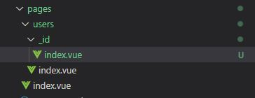

## 폴더, 파일 이름으로 라우팅

<kbd></kbd>

* root("/") url : pages/index.vue
* "/users" url : pages/users/index.vue

<br/><br/>

## 동적 Path

파일 이름 또는 폴더 이름을 언더스코어("_")를 붙이고 만들면, 동적 파라미터 Path로 인식한다.

* 파일 이름<br/>
<kbd></kbd>

* 폴더 이름<br/>
<kbd></kbd>

<br/>

페이지에서 $route.params로 파라미터 값 접근 가능. ex) $route.params.id

<br/><br/>

## Link

일반 앵커(a) 태그로 링크 element를 작성하면, 다시 SSR 된 페이지를 받아온다. 첫 페이지 이후, SPA 방식으로 링크를 연결하려면, `nuxt-link` 엘리먼트로 작성해야한다.<br/>

```html
<nuxt-link to="/users">
```

또는 script에서 $router.push로 연결.<br/>
<kbd></kbd>

<br/><br/>

## 매개변수 검증

`validate` 메서드로 매개 변수를 검증할 수 있다.<br/>

<kbd></kbd>

validate 메서드는 매개변수인 data에서 params, query, store 드의 정보를 얻을 수 있으며, 메서드에서 false를 반환하면 error 페이지로 이동한다.


