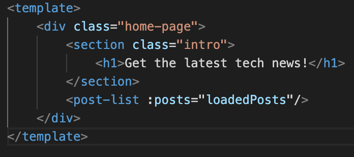

# 데이터 요청 이후 페이지 렌더링을 위한 asyncData

nuxt는 첫 페이지를 SSR로 반환하는데, 다른 서버로부터 데이터를 받아와서 페이지를 렌더링을 해야하는 경우에는 `asyncData` 메서드를 이용한다. 

<br/>

## 일반 vue data

먼저, 아래와 같은 template이 있다고 했을 때

<kbd width="50%"></kbd>

<br/>

post-list 컴포넌트에 전달할 loadedPosts 데이터를 아래처럼 일반 vue data 메서드로 작성하면

<kbd width="70%"></kbd>

마치 CSR처럼 post-list 컴포넌트는 비워진 상태로 페이지가 로드 된 후, setTimeout 메서드에 의해 1500밀리초가 지난 뒤 데이터가 생성되면서 post-list 컴포넌트가 렌더링 된다. <br/> 사람이 사용하는 입장에서는 크게 문제가 되지 않을 수 있으나, 웹 크롤러 입장에서는 내용이 비어있는 페이지를 반환 받게 되기때문에 SEO가 제대로 되지 않는 문제가 발생한다.

<br/><br/>

## nuxt의 asyncData

asyncData 메서드로 데이터를 작성하면, asyncData가 데이터를 반환하기 전에는 페이지가 렌더링 되지 않는다. 즉, asyncData에서 다른 서버로 데이터를 받아와서 반환하면, 그 이후 asyncData에서 반환한 데이터와 함께 페이지 렌더링이 시작되는 것이다.<br/> 여기서 주의헤야 할 점은, 서버측에서 페이지를 렌더링 중이기 때문에 vue 인스턴스가 생성되기 전이며, 그렇기 떄문에 this 키워드로 vue 인스턴스의 data나 methods에 접근할 수 없다. 다만, context 파라미터에서 nuxt에 대한 환경설정이나 routing에 대한 정보(url, parameter) 등은 얻을 수 있다.

<br/>

* Promise 객체 사용

<kbd width="70%"></kbd>

<br/>

* callback 파라미터 사용

<kbd width="70%"></kbd>

<br/><br/>

## asyncData에서 console.log (universal 모드)

```javascript
asyncData() {
	console.log('asyncData is executed!');
	...
	...
}
```

* 첫 페이지 로드

asyncData에서 위 코드처럼 console.log를 남겼을 때, 브라우저에서 처음 url을 입력해서 페이지를 받아오거나 새로고침을 하는 경우, log는 브라우저가 아니라 node 서버에 남는다.

<br/>

* 페이지 안에서 nuxt-link로 이동할 때

첫 페이지 로드 이후에는 SPA 방식으로 구동되기 때문에 브라우저의 console에 log가 출력된다.

<br/><br/>

## error page 반환

* callback 메서드 사용

```javascript
asyncData(context, callback) {
	//첫번째 파라미터가 null이 아니면, 에러 페이지 반환
	callback(new Error(), {});
}
```
위의 코드에서 callback로 받는 메서드에 첫 번째 파라미터가 null이 아니면, error page(layouts에 정의한 페이지)가 출력된다. 하지만 위의 방식으로 처리하면 두 번째 파라미터값이 있어도, 무조건 에러 페이지가 반환된다는 문제점이 있다. 그래서 첫 번째 파라미터값을 적절히 컨트롤 해줘야하는데, 별로 세련되지 못한 방법이다.

<br/>

* Promise 사용

```javascript
asyncData(context) {
    return new Promise((resolve, reject) => {
        
		//백엔드 서버로 데이터 요청...
		...

		//성공
		resolve(데이터 object);
		
		//실패
		reject();
	});
}
```

코드를 Promise를 반환하는 방식으로 변경하면, 실패에 따라 에러 페이지를 반환하는 것을 좀 더 알아보기 쉽고 편하게 작성할 수 있다.

